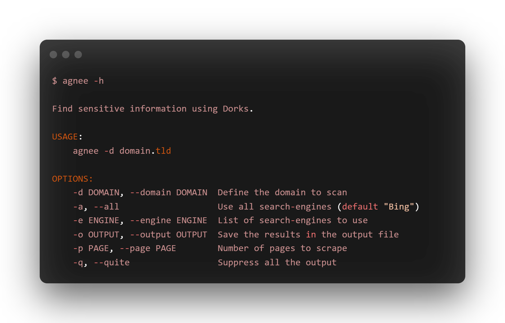

<h1 align="center">
  <br>
  <a href="https://github.com/R0X4R/Agnee"></a>
</h1>

<h4 align="center"><b>Find sensitive information using dorks from different search-engines.</b></h4><br>

<p align="center">
  <a href="https://github.com/R0X4R/Agnee/releases">
    
  </a>
  <a href="#"></a>
<a href="https://twitter.com/R0X4R/"></a>
<a href="https://github.com/R0X4R/Agnee/issues"></a>
<a href="https://github.com/R0X4R/Agnee/blob/main/LICENSE"></a>
<a href="https://github.com/R0X4R?tab=followers"></a>
  <a href="https://github.com/R0X4R/Agnee/issues?q=is%3Aissue+is%3Aclosed">
      
  </a>
  <a href="https://travis-ci.com/R0X4R/Agnee">
      
  </a>
</p>

<p align="center"></p>

---

Agnee uses [`search_engines`](https://github.com/tasos-py/Search-Engines-Scraper) to find sensitive information about given domain using multiple dorks through mutltiple search-engines. I have modified some code of `search_engines` and used it in this script to get the custom results and currently it only find results from bing, google and yahoo (will implement more in future for sure).

### Installation

```bash
sudo pip3 install git+https://github.com/R0X4R/Search-Engines-Scraper.git && sudo pip3 install agnee
```

> **Note**: Before installing agnee you must need git and python3 installed on your system.

### Usage

+ **Simple usage arguments**
    
    ```css
    $ agnee -d testphp.vulnweb.com

    https://www.exploit-db.com/ghdb/6630
    https://www.exploit-db.com/ghdb/5665
    http://testphp.vulnweb.com/secured/phpinfo.php
    ```

+ **To use a specific engine**

    ```css
    $ agnee -d testphp.vulnweb.com -e yahoo

    Yahoo Dork: inurl:"/.git" testphp.vulnweb.com -github

    https://www.exploit-db.com/ghdb/6630
    https://www.exploit-db.com/ghdb/5665
    http://testphp.vulnweb.com/secured/phpinfo.php
    ```

+ **To search specific number of pages**
    ```css
    $ agnee -d testphp.vulnweb.com -p 1
    ```
	
+ **Use all the search-engines**

    ```css
    $ agnee -d testphp.vulnweb.com -all
    ```
    > **Note**: Sometimes google may block your requests so you need to wait for few hours.
---

### Donate
If this tool helped you or you like my work

|[`buymeacoffee.com/R0X4R`](https://www.buymeacoffee.com/R0X4R)|[`pmny.in/bIKNZngt4ys1`](https://pmny.in/bIKNZngt4ys1)|[`ko-fi.com/R0X4R`](https://ko-fi.com/i/IK3K34SJSA)|
|--------|--------|------|

**Warning:** This code was originally created for personal use, do not abuse the traffic, please use with caution.
